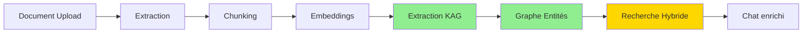
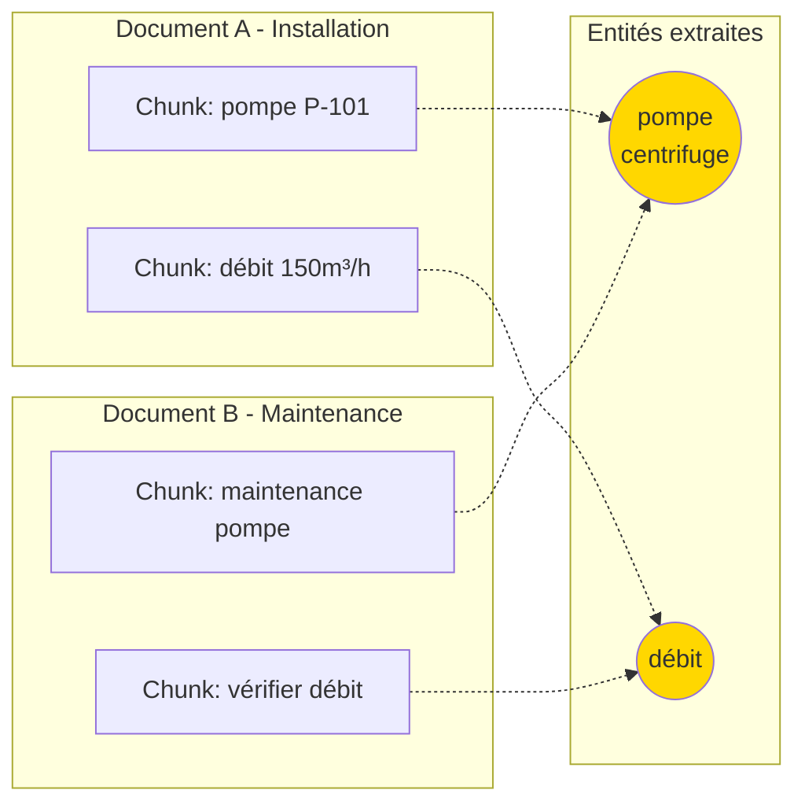
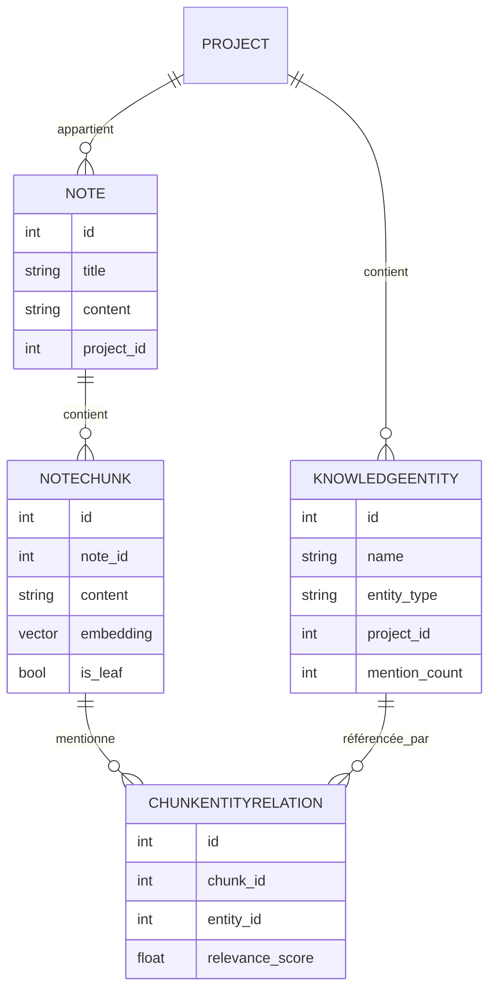

# Architecture RAG + KAG-Lite - Noton App

Ce document explique le fonctionnement complet du système RAG (Retrieval-Augmented Generation) enrichi par KAG-Lite (Knowledge-Augmented Generation) dans l'application Noton, de la lecture des documents jusqu'à la recherche sémantique intelligente.

## Table des matières

1. [Vue d'ensemble](#vue-densemble)
2. [Lecture des documents](#1-lecture-des-documents)
3. [Découpage en chunks](#2-découpage-en-chunks)
4. [Génération des embeddings](#3-génération-des-embeddings)
5. [Extraction KAG - Graphe de connaissances](#4-extraction-kag---graphe-de-connaissances) 🆕
6. [Stockage](#5-stockage)
7. [Recherche sémantique enrichie KAG](#6-recherche-sémantique-enrichie-kag) ⭐
8. [Architecture asynchrone](#7-architecture-asynchrone)
9. [Utilisation dans le chat](#8-utilisation-dans-le-chat)

---

## Vue d'ensemble

Le système combine RAG classique avec KAG-Lite (graphe de connaissances) pour :
- **Extraire** le contenu de documents (PDF, DOCX, images, etc.)
- **Découper** le contenu en chunks optimisés pour la recherche
- **Générer** des embeddings vectoriels pour chaque chunk
- **🆕 Extraire les entités** techniques (équipements, procédures, paramètres) via LLM
- **🆕 Créer un graphe** de connaissances entre chunks partageant les mêmes entités
- **Stocker** embeddings + graphe dans PostgreSQL avec pgvector
- **Rechercher** via similarité vectorielle **+ traversée du graphe** pour des résultats enrichis



---

## 1. Lecture des documents

**Fichier principal** : `app/services/document_service.py`

### Processus d'upload

Lorsqu'un utilisateur upload un document via l'endpoint `/api/projects/{project_id}/documents` :

1. **Création immédiate d'une note** avec :
   - Statut : `pending`
   - Contenu : "⏳ Traitement en cours..."
   - Type : `document`
   - Chemin du fichier sauvegardé

2. **Sauvegarde du fichier** dans `media/documents/` avec un nom unique (UUID)

3. **Ajout à la file d'attente** par projet (traitement séquentiel par projet pour éviter la surcharge)

### Stratégie de traitement

La fonction `process_document()` utilise une stratégie optimisée en deux étapes :

#### Stratégie 1 : PDF avec texte natif (ultra-rapide)
- **Outil** : PyMuPDF (fitz)
- **Méthode** : Extraction directe du texte natif
- **Performance** : Quasi-instantané (quelques millisecondes)
- **Cas d'usage** : PDFs avec texte sélectionnable

#### Stratégie 2 : Documents complexes (Docling)
- **Outil** : Docling DocumentConverter
- **Méthode** : Conversion structurée en markdown + **JSON** pour le chunking (voir ci-dessous)
- **Performance** : Plus lent mais nécessaire pour :
  - PDFs scannés (avec OCR)
  - DOCX/XLSX/PPTX (conversion structurée)
  - Images (OCR)

#### OCR (schémas techniques, cotes)
- **Activation** : Configurable via `DOCLING_OCR_ENABLED` (défaut : `true`) et `DOCLING_OCR_LANG` (ex. `fr,en` ou `fra+eng`).
- **Moteurs** : EasyOCR ou Tesseract selon les options Docling (`PdfPipelineOptions`, `EasyOcrOptions` / `TesseractOcrOptions`). L’OCR permet de capturer le texte dans les images et schémas (cotes, légendes).
- **Format de sortie** : Le DocumentConverter produit en une seule passe le **markdown** (pour `note.content`) et le **JSON** du `DoclingDocument` (pour le DoclingNodeParser). Le JSON conserve les coordonnées (bbox) et la hiérarchie (tableaux, pictures, légendes).

### Résultat

Le contenu extrait est stocké dans `note.content` au format **markdown**, prêt pour l’affichage. Le chunking sémantique utilise exclusivement le **JSON** Docling (jamais le Markdown) pour préserver la structure.

---

## 2. Découpage en chunks

**Fichier principal** : `app/services/chunking_service.py`

### Configuration

- **Taille des chunks** : 1000 caractères maximum (≈250 tokens)
- **Overlap** : 100 caractères (10% de chevauchement entre chunks)
- **Algorithme** : Adaptatif qui respecte la structure markdown

### Algorithme de chunking

La fonction `chunk_note()` utilise un algorithme intelligent :

1. **Combinaison** : Titre + contenu de la note
2. **Séparation en paragraphes** : Découpe selon `\n\n` (paragraphes markdown)
3. **Regroupement intelligent** :
   - Ne coupe jamais au milieu d'un paragraphe
   - Regroupe les paragraphes jusqu'à atteindre ~1000 caractères
   - Pour les très longs paragraphes : coupe aux fins de phrases

4. **Overlap** : Les chunks se chevauchent de 100 caractères pour maintenir le contexte

### Métadonnées des chunks

Chaque chunk contient :
- `chunk_index` : Position dans la note (0, 1, 2...)
- `start_char` : Position de début dans le texte original
- `end_char` : Position de fin dans le texte original
- `content` : Texte du chunk

### Documents importés (Docling) : chunking sémantique et JSON

Pour les documents traités par **Docling** (`document_service.py`), le découpage ne repose pas sur le markdown mais sur la **structure JSON** du document. Le `DocumentConverter` produit un `DoclingDocument` sérialisé en JSON via `model_dump_json()`, transmis au **DoclingNodeParser** (`chunking_service.py`). Ce format préserve la structure hiérarchique des tableaux (colonnes/lignes) et limite les confusions de valeurs numériques. Ne pas remplacer ce flux par du Markdown pour le parser. Voir `app/services/document_service.py` (création des `llama_docs`) et `app/services/chunking_service.py` (`chunk_note_from_docling_docs`).

#### Hiérarchie et étiquetage par section (parent_heading)
- Chaque chunk est **étiqueté** par le titre de sa section : `parent_heading` est le libellé complet construit à partir de tous les niveaux de headings (ex. « 1.3.1 Montage », « 2 Drainage »).
- Le regroupement pour les nœuds parents se fait par ce même libellé : tous les blocs (paragraphes, tableaux, schémas) d’une même section sont regroupés sous un parent commun, ce qui garde **texte et schéma ensemble**.

#### Tableaux et schémas comme une seule unité
- Le **HierarchicalChunker** Docling produit un chunk par élément (paragraphe, tableau, picture). Les tableaux et schémas ne sont pas recoupés ; ils restent une seule unité.

#### Légendes (fusion et injection)
- Pour les blocs **picture** ou **table**, la légende (ex. « Fig. 4 : Détail du perçage ») est **fusionnée** au texte du chunk.
- La légende est aussi **injectée** dans les métadonnées de tous les chunks de la même section (`image_anchor`, `figure_title`), afin que le contexte de la section soit disponible pour la recherche et le LLM.

#### Métadonnées stockées (metadata_json)
- **parent_heading** : titre de section (sujet).
- **page_no** : numéro de page (fourni par Docling).
- **figure_title** / **image_anchor** : légende(s) de la figure ou du tableau (section ou chunk).
- **contains_image** : présent et à `true` lorsque le chunk ou la section contient une image/table avec légende.

### Stockage initial

Les chunks sont créés **sans embeddings** (rapide) et stockés dans la table `notechunk`. Les embeddings seront générés en arrière-plan.

---

## 3. Génération des embeddings

**Fichier principal** : `app/services/embedding_service.py`

### Modèle utilisé

- **Modèle** : Ollama `nomic-embed-text`
- **Dimensions** : 768 (configuré dans `app/embedding_config.py`)
- **API** : `POST {OLLAMA_BASE_URL}/api/embeddings`

### Processus de génération

#### Traitement par batch

La fonction `generate_embeddings_batch()` optimise les performances :

1. **Regroupement** : Traite jusqu'à 32 chunks à la fois
2. **Appels API** : Un appel par texte (Ollama API)
3. **Connexion réutilisable** : Utilise `httpx.Client` pour optimiser les requêtes HTTP

#### Insertion optimisée

La fonction `_process_embeddings_for_note()` utilise une méthode ultra-rapide :

1. **Table temporaire** : Crée une table temporaire PostgreSQL
2. **COPY** : Utilise `copy_expert` pour insérer tous les embeddings en une seule opération
3. **UPDATE batch** : Met à jour tous les chunks en une seule requête SQL

```python
# Exemple de la requête batch
UPDATE notechunk
SET embedding = temp_chunk_embeddings.embedding_vector::vector
FROM temp_chunk_embeddings
WHERE notechunk.id = temp_chunk_embeddings.chunk_id
```

### Résultat

Chaque chunk reçoit un **embedding vectoriel de 1024 dimensions** (BGE-m3) stocké dans la colonne `embedding` de type `Vector(1024)` (pgvector).

---

## 4. Extraction KAG - Graphe de connaissances 🆕

**Fichiers principaux** : 
- `app/services/kag_extraction_service.py` (extraction LLM)
- `app/services/kag_graph_service.py` (gestion du graphe)

### Qu'est-ce que KAG-Lite ?

KAG-Lite ajoute une **couche de graphe de connaissances** au RAG classique. Au lieu de se fier uniquement à la similarité vectorielle, le système identifie les **entités techniques** mentionnées dans les documents et crée des liens entre chunks qui parlent des mêmes concepts.

### Exemple concret

Imaginez deux documents dans un projet :

**Document A - Guide d'installation** :
> "La **pompe centrifuge P-101** doit être montée sur un socle béton. Le **débit nominal** est de 150 m³/h."

**Document B - Procédure de maintenance** :
> "Lors de la maintenance de la **pompe centrifuge**, vérifier le **débit** et remplacer les joints."

Le système KAG va extraire et lier :
- Entité : `pompe centrifuge` → présente dans Document A et Document B
- Entité : `débit` → présente dans Document A et Document B

Quand vous cherchez "maintenance pompe", le système trouvera Document B (match direct) **mais aussi** Document A via le graphe (même entité "pompe centrifuge").



### Types d'entités extraites

| Type | Exemples | Usage |
|------|----------|-------|
| `equipement` | pompe, vanne, moteur, capteur | Matériel technique |
| `procedure` | montage, maintenance, calibration | Actions/processus |
| `parametre` | débit, pression, température | Valeurs mesurables |
| `composant` | joint, roulement, axe | Pièces détachées |
| `reference` | P-101, ISO-9001, REF-2024 | Codes/normes |
| `lieu` | salle des machines, zone A | Localisations |

### Processus d'extraction

1. **Après les embeddings**, chaque chunk feuille est analysé par un LLM (configurable : OpenAI gpt-4o-mini ou Ollama)

2. **Prompt structuré** :
```
Extrais les entités techniques de ce texte.
Types possibles: equipement, procedure, parametre, composant, reference, lieu

Retourne UNIQUEMENT un JSON valide:
[{"name": "pompe centrifuge", "type": "equipement", "importance": 0.9}]

Texte: {contenu du chunk}
```

3. **Le LLM retourne** une liste d'entités avec leur importance (0.0 à 1.0)

4. **Déduplication** : Les entités sont normalisées (minuscules, sans accents) pour éviter les doublons

5. **Stockage** : Les entités et leurs relations aux chunks sont sauvegardées dans PostgreSQL

### Tables du graphe

**Table `knowledgeentity`** :
- `name` : Nom original ("Pompe Centrifuge")
- `name_normalized` : Nom normalisé ("pompe centrifuge")
- `entity_type` : Type d'entité
- `project_id` : Isolation par projet
- `mention_count` : Nombre de fois mentionnée
- `embedding` : Embedding de l'entité (optionnel, future amélioration)

**Table `chunkentityrelation`** :
- `chunk_id` : Référence au chunk
- `entity_id` : Référence à l'entité
- `relevance_score` : Importance (0.0-1.0) retournée par le LLM
- `project_id` : Pour optimisation des requêtes

### Coût de l'extraction

L'extraction KAG est économique car :
- **Input** : ~500-2000 tokens (chunk + prompt) → ~0.00008$ avec gpt-4o-mini
- **Output** : ~50-100 tokens (JSON compact) → ~0.00005$
- **Total par chunk** : ~0.00013$
- **Traitement une seule fois** : À l'indexation, pas à chaque recherche

Pour 1000 chunks : ~**0.13$** d'extraction, amorti sur toutes les futures recherches.

---

## 5. Stockage

**Fichier principal** : `app/models/note_chunk.py`

### Structure de la table `NoteChunk`

```python
class NoteChunk(SQLModel, table=True):
    id: Optional[int]                    # ID unique du chunk
    note_id: int                         # Référence à la note parente
    chunk_index: int                     # Position dans la note (0, 1, 2...)
    content: str                         # Texte du chunk
    embedding: Optional[List[float]]     # Vector(1024) - embedding pgvector BGE-m3
    start_char: int                      # Position de début dans la note originale
    end_char: int                        # Position de fin dans la note originale
    node_id: Optional[str]               # ID pour hiérarchie LlamaIndex
    parent_node_id: Optional[str]        # Parent dans la hiérarchie
    is_leaf: bool                        # Est-ce un nœud feuille ?
    hierarchy_level: int                 # Niveau dans l'arbre
    metadata_json: Optional[dict]        # Métadonnées (headings, page_no, etc.)
```

### Tables KAG (graphe de connaissances) 🆕

```python
class KnowledgeEntity(SQLModel, table=True):
    id: Optional[int]
    name: str                            # "Pompe Centrifuge"
    name_normalized: str                 # "pompe centrifuge" (dédupliqué)
    entity_type: str                     # equipement, procedure, parametre...
    project_id: int                      # Isolation par projet
    mention_count: int                   # Fréquence d'apparition
    created_at: datetime
    updated_at: datetime

class ChunkEntityRelation(SQLModel, table=True):
    id: Optional[int]
    chunk_id: int                        # FK vers NoteChunk
    entity_id: int                       # FK vers KnowledgeEntity
    relevance_score: float               # Importance 0.0-1.0 (du LLM)
    project_id: int                      # Dénormalisé pour perfs
    created_at: datetime
```

### Schéma relationnel



### Base de données

- **SGBD** : PostgreSQL
- **Extension** : pgvector (pour le stockage et la recherche vectorielle)
- **Type de colonne** : `Vector(1024)` pour les embeddings (BGE-m3)
- **Index** : 
  - HNSW sur les embeddings pour recherche rapide
  - B-tree sur `project_id`, `entity_type`, `name_normalized` pour KAG
  - Unique sur `(project_id, name_normalized)` pour déduplication

### Avantages de cette architecture

- **Recherche native** : Opérateurs SQL pour la similarité vectorielle
- **Performance** : Index HNSW pour recherche vectorielle + index B-tree pour graphe
- **Intégration** : Fonctionne directement avec SQLModel/SQLAlchemy
- **Pas de Neo4j** : Le graphe KAG est stocké en relationnel (plus simple à déployer)
- **Isolation** : Chaque projet a son propre graphe de connaissances

---

## 6. Recherche sémantique enrichie KAG ⭐

**Fichier principal** : `app/services/semantic_search_service.py`

### Deux fonctions de recherche

#### a) `search_relevant_notes()` - Recherche par note

**Objectif** : Retourner les notes les plus pertinentes

**Processus** :
1. Génère l'embedding de la requête utilisateur
2. Recherche les chunks les plus pertinents avec pgvector
3. Groupe par note (`DISTINCT ON (nc.note_id)`)
4. Retourne les k notes les plus pertinentes avec leur score

**Utilisation** : Pour obtenir une vue d'ensemble des notes pertinentes

#### b) `search_relevant_passages()` - Recherche par chunk ⭐

**Objectif** : Retourner les passages (chunks) les plus pertinents

**Processus** :
1. Génère l'embedding de la requête utilisateur
2. **Recherche vectorielle SQL** (pgvector) sur les leaves → `k * 3` candidats
3. **🆕 Enrichissement KAG** :
   - Extraction termes de la query (ex: "pompe", "maintenance")
   - Lookup SQL : `SELECT chunks WHERE entity_name IN (terms)`
   - Graph boost : +0.15 aux chunks trouvés via entités
4. **Fusion intelligente** des candidats vectoriels et KAG
5. **Filtrage pré-reranking** (similarité > 0.25)
6. **Reranking BGE-reranker-v2-m3** sur max 30 candidats
7. **Résolution des parents** (contexte enrichi)
8. Retourne les **k** passages finaux

**Reranker et titres descriptifs** : Avant le reranking, le texte de chaque candidat est enrichi avec `parent_heading` et `figure_title` (section et légende). Les chunks dont le titre de section ou la légende sont très descriptifs sont ainsi mieux notés par le reranker. Le passage final envoyé au LLM inclut aussi cette en-tête (section + légende) pour un contexte explicite.

**Paramètres** (voir `semantic_search_service.py` et `app/routers/chat.py`) :
- **k** (nombre de passages envoyés au LLM) : configurable via `RAG_TOP_K` (défaut : 10)
- **MAX_RERANK_CANDIDATES** : nombre max de candidats rerankés (défaut : 30)
- **graph_boost** : bonus de score pour candidats KAG (défaut : 0.15)

**Utilisation** : Pour enrichir le contexte du chatbot avec des passages précis

### Exemple de fusion vectoriel + KAG

Query : "maintenance pompe centrifuge"

```
Candidats vectoriels (similarité cosinus) :
  ┌──────────────────────────────────────────────┐
  │ Chunk A: 0.85 - "procédure maintenance..."  │
  │ Chunk B: 0.72 - "vérifier le débit..."      │
  │ Chunk D: 0.68 - "remplacer les joints..."   │
  └──────────────────────────────────────────────┘

Candidats KAG (via entité "pompe centrifuge") :
  ┌──────────────────────────────────────────────┐
  │ Chunk A: 0.70 - mentions "pompe centrifuge" │
  │ Chunk C: 0.65 - "pompe P-101, débit 150..."│
  │ Chunk E: 0.60 - "montage sur socle béton..." │
  └──────────────────────────────────────────────┘

Après fusion (graph_boost +0.15) :
  ┌──────────────────────────────────────────────┐
  │ Chunk A: 0.85  (déjà max dans les deux)     │
  │ Chunk C: 0.80  (0.65 + 0.15, nouveau via KAG)│
  │ Chunk E: 0.75  (0.60 + 0.15, nouveau via KAG)│
  │ Chunk B: 0.72  (vectoriel uniquement)       │
  │ Chunk D: 0.68  (vectoriel uniquement)       │
  └──────────────────────────────────────────────┘
```

**Impact** : Chunks C et E (trouvés uniquement via le graphe) remontent devant B et D grâce au boost, enrichissant le contexte avec des infos sur les spécifications techniques de la pompe.

### Requêtes SQL utilisées

**1. Recherche vectorielle (pgvector)** :
```sql
SELECT 
    nc.id as chunk_id,
    nc.content as chunk_content,
    nc.chunk_index,
    n.id as note_id,
    n.title as note_title,
    1 - (nc.embedding <=> '{query_embedding}'::vector) as similarity_score
FROM notechunk nc
INNER JOIN note n ON nc.note_id = n.id
WHERE n.project_id = {project_id}
    AND n.user_id = {user_id}
    AND nc.embedding IS NOT NULL
    AND nc.is_leaf = true
ORDER BY nc.embedding <=> '{query_embedding}'::vector
LIMIT k
```

**2. 🆕 Recherche KAG (graphe entités)** :
```sql
SELECT 
    nc.*,
    ke.name as entity_name,
    cer.relevance_score
FROM notechunk nc
JOIN chunkentityrelation cer ON cer.chunk_id = nc.id
JOIN knowledgeentity ke ON ke.id = cer.entity_id
JOIN note n ON n.id = nc.note_id
WHERE ke.project_id = {project_id}
    AND ke.name_normalized IN ('pompe', 'maintenance', ...)
    AND n.user_id = {user_id}
    AND nc.is_leaf = true
ORDER BY cer.relevance_score DESC
LIMIT k
```

### Opérateur pgvector

- **`<=>`** : Opérateur de distance cosinus
- **`1 - distance`** : Conversion en score de similarité (0 à 1)
- **Tri** : Les chunks les plus similaires sont retournés en premier

### Sécurité

- Vérification que le projet appartient à l'utilisateur
- Filtrage par `project_id` et `user_id` sur **toutes** les requêtes (vectoriel + KAG)
- Seuls les chunks avec embeddings sont recherchés
- **🆕 Isolation KAG** : Chaque projet a son propre graphe d'entités (pas de fuite cross-projets)

---

## 7. Architecture asynchrone

### Workers de documents

**Fichier** : `app/services/document_service.py`

- **File d'attente** : `project_queues[project_id]` (une queue par projet)
- **Workers** : Threads daemon qui traitent les documents séquentiellement par projet
- **Configuration** : `MAX_CONCURRENT_DOCUMENTS` workers en parallèle
- **Isolation** : Traitement isolé pour ne pas bloquer l'application

**Flux** :
```
Upload → File d'attente par projet → Worker → Extraction → Chunking → File d'embeddings → File KAG
```

### Workers d'embeddings

**Fichier** : `app/services/chunk_service.py`

- **File d'attente** : `embedding_queue` (globale)
- **Workers** : 1 worker à la fois (`MAX_CONCURRENT_EMBEDDINGS = 1`)
- **Raison** : Éviter la surcharge CPU (génération d'embeddings intensive)

**Flux enrichi KAG** 🆕 :
```
Chunks créés → File d'embeddings → Worker → Génération batch → Stockage optimisé
                                           ↓
                                    Extraction KAG (LLM) → Graphe entités
```

L'extraction KAG se fait **après** les embeddings, dans le même worker, pour éviter de multiplier les files d'attente.

### Avantages

- **Non-bloquant** : L'upload retourne immédiatement
- **Scalable** : Traitement en arrière-plan
- **Robuste** : Gestion d'erreurs et retry automatique
- **Performant** : Traitement par batch et insertion optimisée
- **🆕 Économique** : Extraction KAG une seule fois à l'indexation (~0.00013$/chunk)

---

## 8. Utilisation dans le chat

**Fichier principal** : `app/routers/chat.py`

### Intégration RAG + KAG

Lorsqu'un utilisateur pose une question dans le chat :

1. **Recherche hybride** : `search_relevant_passages()` trouve les k chunks les plus pertinents via vectoriel + KAG
2. **Construction du contexte** : Les passages sont formatés avec titre de note + section + légende
3. **Enrichissement du prompt** : Les passages sont ajoutés au contexte du LLM
4. **Génération de la réponse** : Le LLM génère une réponse enrichie par le contexte RAG + KAG

### Format du contexte

```markdown
**Titre de la note**
[Section: 2.1 Maintenance]

Contenu du chunk pertinent...

**Autre note**
[Section: 1.3 Installation]
[Figure: Schéma de montage P-101]

Autre chunk pertinent...
```

### Avantages

- **Réponses précises** : Basées sur le contenu réel des documents
- **Contexte local** : Utilise uniquement les notes du projet
- **Transparence** : Les sources sont identifiables (titre de la note)
- **🆕 Connexions sémantiques** : Le graphe KAG ramène des passages liés par les concepts, pas juste par la similarité textuelle
- **🆕 Couverture élargie** : Les chunks peu similaires lexicalement mais sémantiquement liés sont inclus

---

## Schéma complet du flux

```
┌─────────────────┐
│  Upload Document │
└────────┬─────────┘
         │
         ▼
┌─────────────────┐
│  File d'attente  │ (par projet)
└────────┬─────────┘
         │
         ▼
┌─────────────────┐
│  Worker Document │
└────────┬─────────┘
         │
         ▼
┌─────────────────┐
│  Extraction     │ (Docling/PyMuPDF)
│  → Markdown     │
└────────┬─────────┘
         │
         ▼
┌─────────────────┐
│  Chunking       │ (1000 chars, 10% overlap)
│  → NoteChunk    │
└────────┬─────────┘
         │
         ▼
┌─────────────────┐
│  File Embeddings │
└────────┬─────────┘
         │
         ▼
┌─────────────────┐
│  Worker Embedding│
└────────┬─────────┘
         │
         ▼
┌─────────────────┐
│  Génération     │ (Ollama nomic-embed-text)
│  → Vector(768)  │
└────────┬─────────┘
         │
         ▼
┌─────────────────┐
│  Stockage       │ (PostgreSQL + pgvector)
│  → NoteChunk    │
└────────┬─────────┘
         │
         ▼
┌─────────────────┐
│  Recherche      │ (pgvector <=>)
│  → Passages     │
└────────┬─────────┘
         │
         ▼
┌─────────────────┐
│  Chatbot        │ (Contexte enrichi)
└─────────────────┘
```

---

## Configuration

### Variables d'environnement

- `EMBEDDING_MODEL` : Modèle Ollama pour les embeddings (défaut: `nomic-embed-text`)
- `EMBEDDING_DIMENSION` : Dimension des embeddings (défaut: `768`)
- `OLLAMA_BASE_URL` : URL de base d'Ollama
- `MAX_CONCURRENT_DOCUMENTS` : Nombre de workers de documents
- `TORCH_NUM_THREADS` : Nombre de threads PyTorch pour Docling
- `DOCLING_USE_GPU` : Activer/désactiver le GPU pour Docling
- `DOCLING_OCR_ENABLED` : Activer l’OCR pour les schémas et PDF scannés (défaut : true)
- `DOCLING_OCR_LANG` : Langues OCR (ex. `fr,en` ou `fra+eng`, optionnel)
- `RAG_TOP_K` : Nombre de passages RAG envoyés au LLM (défaut : 10)
- `MAX_RERANK_CANDIDATES` : Nombre max de candidats rerankés avant sélection des k passages (défaut : 30)

### Fichiers de configuration

- `app/embedding_config.py` : Configuration centralisée des embeddings
- `app/config.py` : Configuration générale de l'application
- **🆕** `app/models/knowledge_entity.py` : Modèle des entités KAG
- **🆕** `app/models/chunk_entity_relation.py` : Modèle des relations KAG
- **🆕** `app/services/kag_extraction_service.py` : Extraction entités via LLM
- **🆕** `app/services/kag_graph_service.py` : Gestion du graphe de connaissances

---

## Performance et optimisations

### Optimisations implémentées

1. **Extraction rapide** : PyMuPDF pour PDFs avec texte natif
2. **Chunking adaptatif** : Respecte la structure markdown
3. **Batch processing** : Génération d'embeddings par batch (16-32 chunks)
4. **Insertion optimisée** : COPY PostgreSQL pour insertion rapide
5. **Recherche vectorielle native** : pgvector avec index HNSW
6. **Traitement asynchrone** : Workers en arrière-plan
7. **🆕 Extraction KAG économique** : JSON compact, ~0.00013$/chunk, une seule fois
8. **🆕 Graphe SQL natif** : Pas de Neo4j, lookups optimisés avec index B-tree
9. **🆕 Graph boost ajustable** : Pondération fine des candidats KAG (+0.15)
10. **🆕 Filtrage pré-reranking** : Élimine candidats faible similarité (<0.25)

### Métriques

- **Upload** : Retour immédiat (< 1 seconde)
- **Extraction PDF natif** : < 100ms
- **Extraction PDF scanné** : 5-30 secondes (selon la taille)
- **Génération embeddings** : ~100-500ms par batch de 16-32 chunks
- **🆕 Extraction KAG** : ~200-800ms par chunk (LLM API, en background)
- **Recherche vectorielle** : < 50ms
- **🆕 Recherche KAG** : < 30ms (SQL JOIN optimisé)
- **Fusion + reranking** : ~1-3s pour 30 candidats
- **Total recherche hybride** : < 5s pour top-10 passages

---

## Conclusion

Le système RAG + KAG-Lite de Noton App est conçu pour être :
- **Performant** : Traitement asynchrone et optimisations multiples
- **Scalable** : Architecture modulaire avec workers
- **Précis** : Recherche sémantique vectorielle + graphe de connaissances
- **Robuste** : Gestion d'erreurs et fallbacks
- **🆕 Intelligent** : Connexions sémantiques via entités techniques extraites
- **🆕 Économique** : Extraction LLM amortie sur toutes les recherches futures
- **🆕 Simple** : Pas de framework lourd (Neo4j, GNN), tout en PostgreSQL

### Avantages du système hybride

**Sans KAG** (vectoriel uniquement) :
- Query : "maintenance pompe"
- Résultats : chunks avec les mots "maintenance" et "pompe" proches vectoriellement
- Limitation : rate les specs techniques, l'installation, les références croisées

**Avec KAG** (vectoriel + graphe) :
- Query : "maintenance pompe"
- Résultats vectoriels : procédures de maintenance
- **+ Résultats KAG** : spécifications de la pompe P-101, schéma d'installation, paramètres de débit
- Bénéfice : contexte enrichi avec infos connexes via les entités partagées

Le système permet d'enrichir les réponses du chatbot avec le contenu réel des documents uploadés par l'utilisateur, en créant automatiquement des liens sémantiques entre concepts, offrant une expérience de chat contextuelle, précise et intelligente.
