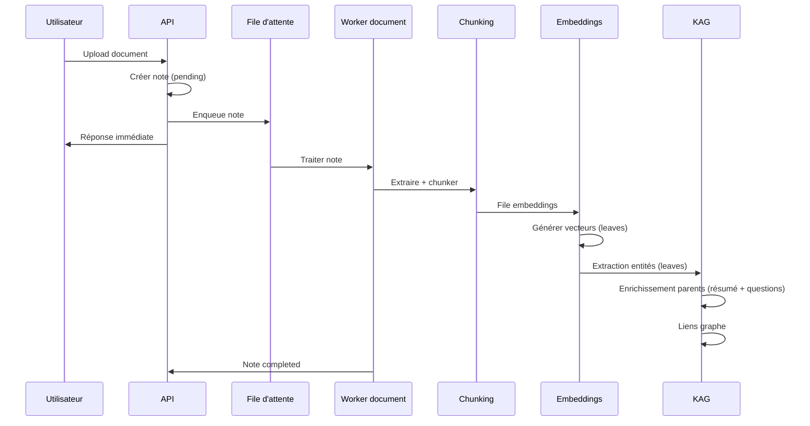
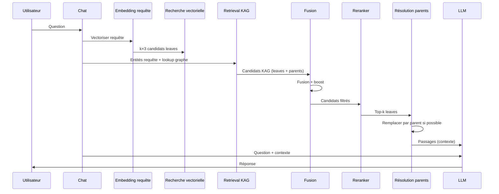

# Pipeline document → réponse : vue d’ensemble

Ce document décrit le parcours complet d’un document, de son dépôt jusqu’à la réponse du chat, sans entrer dans le détail technique (aucun extrait de code). Chaque étape est détaillée dans un fichier dédié.

---

## Chaîne globale

```mermaid
flowchart LR
  subgraph depot [Dépôt]
    A[Upload document]
  end
  subgraph extraction [Extraction]
    B[Docling / PyMuPDF]
    C[Contenu structuré]
  end
  subgraph indexation [Indexation]
    D[Chunking]
    E[Embeddings]
    F[KAG]
  end
  subgraph requete [Requête utilisateur]
    G[Recherche vectorielle]
    H[Enrichissement KAG]
    I[Reranker]
    J[Résolution parents]
  end
  subgraph reponse [Réponse]
    K[Contexte RAG]
    L[LLM]
    M[Réponse]
  end
  A --> B --> C --> D --> E --> F
  F --> G --> H --> I --> J --> K --> L --> M
```

---

## Les cinq grandes étapes

| Étape | Rôle | Document détaillé |
|--------|------|-------------------|
| **Chunking** | Découper le contenu en blocs (sections / fragments) avec une hiérarchie parent / leaf. | [01-chunking.md](01-chunking.md) |
| **Embedding et KAG** | Vectoriser les fragments (leaves), extraire les entités et enrichir les sections (parents) pour alimenter le graphe de connaissances. | [02-embedding-et-kag.md](02-embedding-et-kag.md) |
| **Retrieval KAG** | Trouver les passages pertinents : recherche vectorielle sur les leaves, puis enrichissement via le graphe (entités, relations, leaves et parents). | [03-retrieval-kag.md](03-retrieval-kag.md) |
| **Reranker et réponse** | Filtrer, reranker les candidats, résoudre les parents pour construire le contexte final envoyé au LLM. | [04-reranker-et-reponse.md](04-reranker-et-reponse.md) |

---

## Flux temporel côté indexation

L’indexation est asynchrone : l’utilisateur reçoit une réponse immédiate après l’upload ; le traitement se fait en arrière-plan.

---

## Flux temporel côté requête (chat)

Lors d’une question dans le chat, la recherche et la construction du contexte suivent un enchaînement fixe.

---

## Concepts clés

- **Leaf (fragment)** : plus petite unité indexée pour la recherche vectorielle (paragraphe, ligne de tableau, légende, etc.). Seuls les leaves ont un embedding.
- **Parent (section)** : regroupement de leaves sous un même titre de section (ex. « 1.3.1 Montage », « 2 Drainage »). Le parent porte l’intention métier ; il peut être enrichi (résumé, questions) et relié au graphe KAG.
- **KAG (Knowledge-Augmented Generation)** : graphe d’entités (équipement, procédure, paramètre, etc.) et de relations chunk–entité. Il permet de retrouver des passages par concepts partagés, en plus de la similarité vectorielle.
- **Résolution parents** : pour chaque leaf retenu après rerank, on remplace le passage par le contenu du parent (section entière) afin d’envoyer au LLM un contexte plus cohérent.

Les documents suivants décrivent chaque étape avec des schémas détaillés et sans extraits de code.
