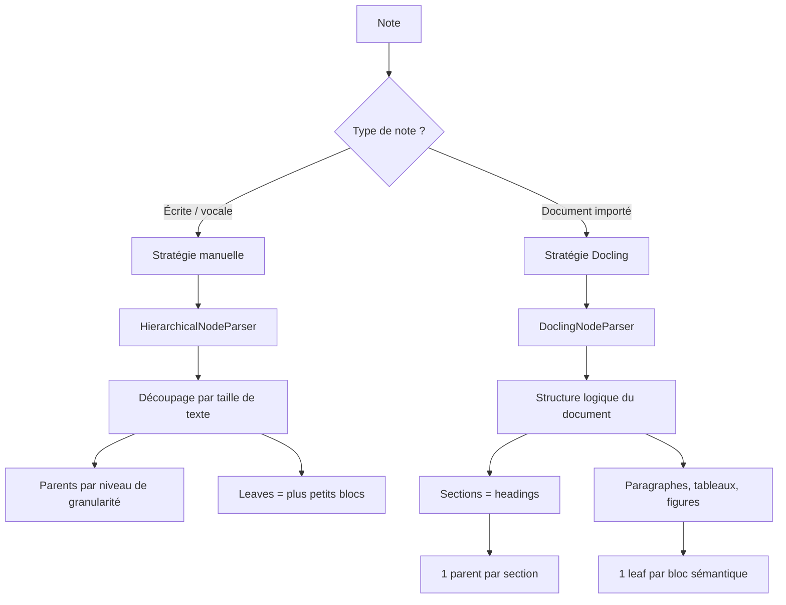
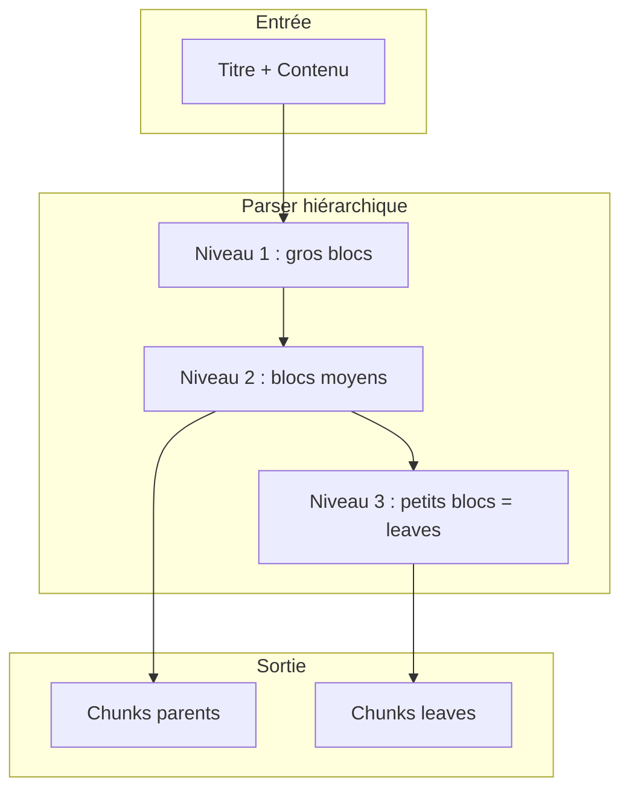
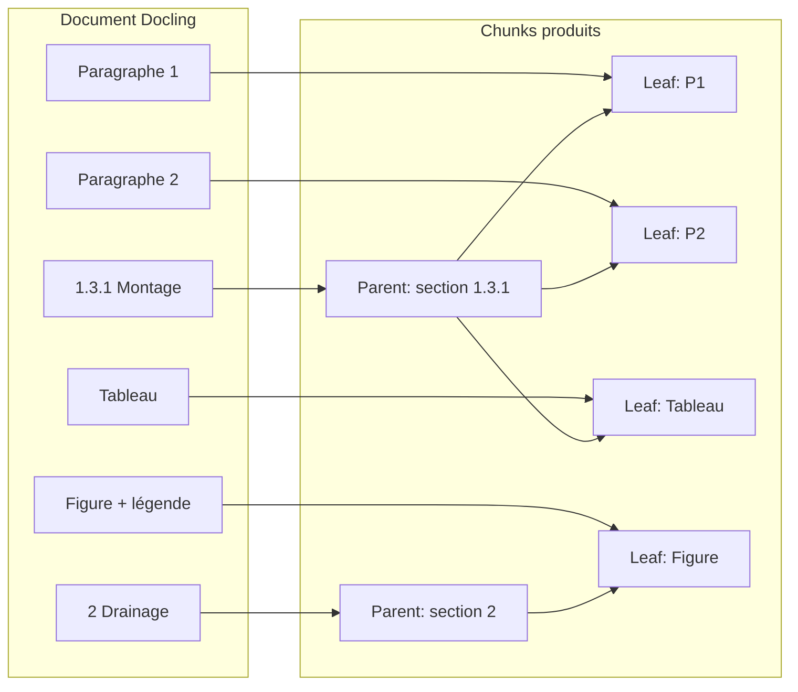
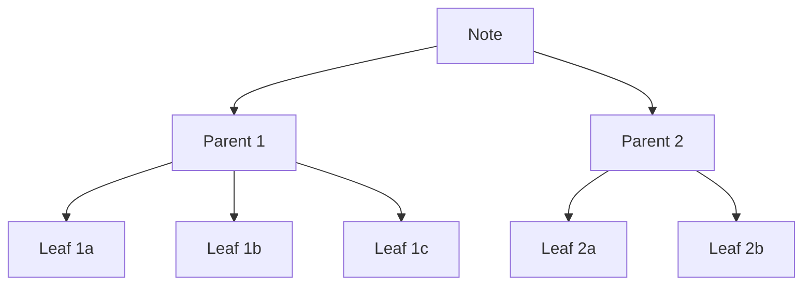

# Étape 1 : Chunking (découpage en blocs)

Le chunking transforme le contenu d’une note en une liste de **blocs** (chunks) avec une **hiérarchie** : des nœuds **parents** (sections) et des nœuds **leaves** (fragments). Cette structure est utilisée ensuite pour les embeddings, le graphe KAG et la résolution du contexte envoyé au LLM.

---

## Deux stratégies selon le type de note

Le système applique une stratégie différente selon que la note est **créée à la main** (écrite, vocale) ou **issue d’un document importé** (PDF, DOCX, etc.) traité par Docling.

---

## Stratégie 1 : Notes manuelles (écrites, vocales)

- **Entrée** : titre + contenu texte de la note (éventuellement converti depuis la voix).
- **Outil** : parser hiérarchique par **taille de texte** (trois niveaux de granularité configurables, ex. 3072, 1024, 384 caractères).
- **Principe** : le texte est découpé en nœuds de tailles décroissantes ; chaque nœud de niveau supérieur contient plusieurs nœuds de niveau inférieur. Les **leaves** sont les plus petits blocs ; les **parents** sont les agrégats de niveau au-dessus.
- **Ordre** : les chunks sont triés par niveau hiérarchique puis par position dans le document pour garder l’ordre de lecture.

Les métadonnées de base (note_id, project_id, user_id, note_title) sont attachées à chaque chunk. Les champs `node_id`, `parent_node_id`, `hierarchy_level` et `is_leaf` décrivent la hiérarchie.

---

## Stratégie 2 : Documents importés (Docling)

- **Entrée** : document déjà converti par Docling en structure logique (JSON), pas le markdown brut. Le JSON préserve sections, tableaux, figures et légendes.
- **Outil** : parser qui respecte cette structure (paragraphes, tableaux, listes, titres de section).
- **Principe** :  
  - Les **frontières de section** viennent des titres (headings) du document.  
  - Un **parent** = une section : agrégat de tous les blocs (paragraphes, tableaux, figures) qui partagent le même titre de section.  
  - Une **leaf** = un bloc sémantique indivisible : un paragraphe, un tableau entier, une figure avec sa légende, etc. Les tableaux et figures ne sont pas recoupés.

Les **légendes** (figures, tableaux) sont fusionnées au texte du chunk concerné et peuvent être injectées dans les métadonnées de section (`figure_title`, `image_anchor`) pour améliorer la recherche et le contexte.

---

## Métadonnées stockées (tous types de chunks)

Chaque chunk est enregistré avec au moins :

- **Identité et position** : `chunk_index`, `start_char`, `end_char`, `node_id`, `parent_node_id`, `hierarchy_level`, `is_leaf`.
- **Contexte note** : `note_id`, `project_id`, `user_id`, `note_title`.

Pour les documents Docling, s’ajoutent notamment :

- **Section** : `parent_heading` (libellé complet de la section, ex. « 1.3.1 Montage », « 2 Drainage »).
- **Page** : `page_no` si disponible.
- **Légendes** : `figure_title`, `image_anchor`, `contains_image` pour les blocs ou sections contenant une figure/tableau.

Ces champs sont stockés dans `metadata_json` (JSONB) et servent au reranker et à la construction du passage final (section + légende) envoyé au LLM.

---

## Hiérarchie parent / leaf en résumé

- **Parents** : portent l’intention métier de la section ; pas d’embedding à ce stade ; peuvent être enrichis plus tard (résumé + questions) pour le KAG.
- **Leaves** : unités sur lesquelles sont calculés les embeddings et extraites les entités KAG (voir [02-embedding-et-kag.md](02-embedding-et-kag.md)).

Le chunking ne génère pas encore d’embeddings ; les blocs sont simplement créés et sauvegardés. La génération des vecteurs et l’extraction KAG ont lieu dans l’étape suivante.
