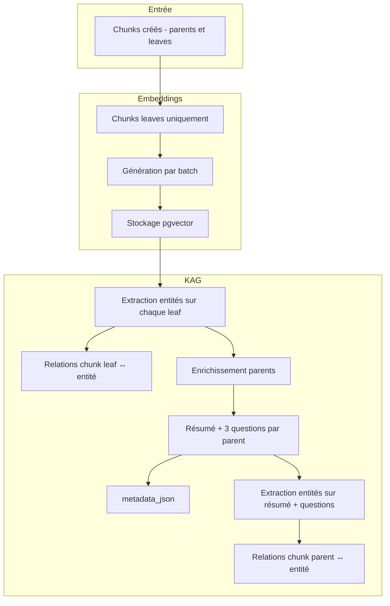
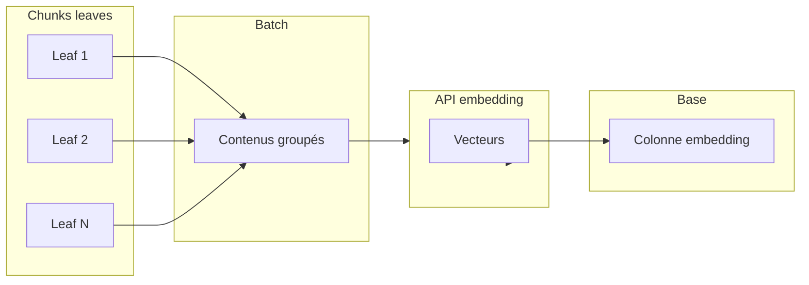
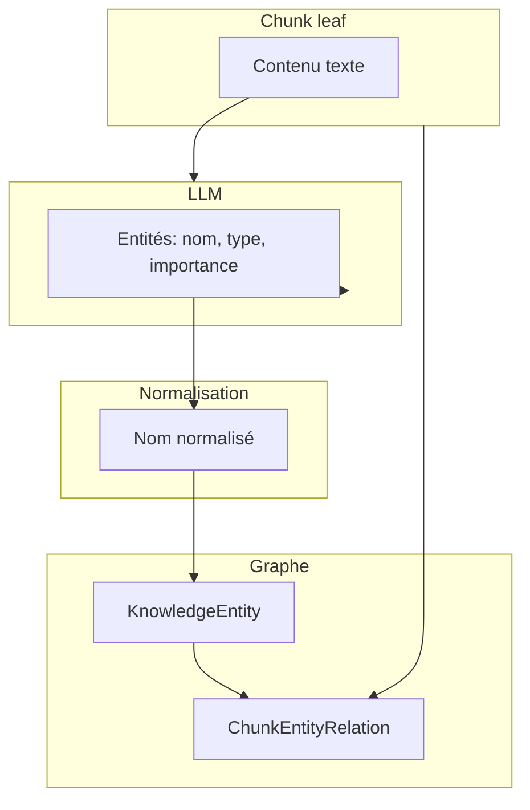
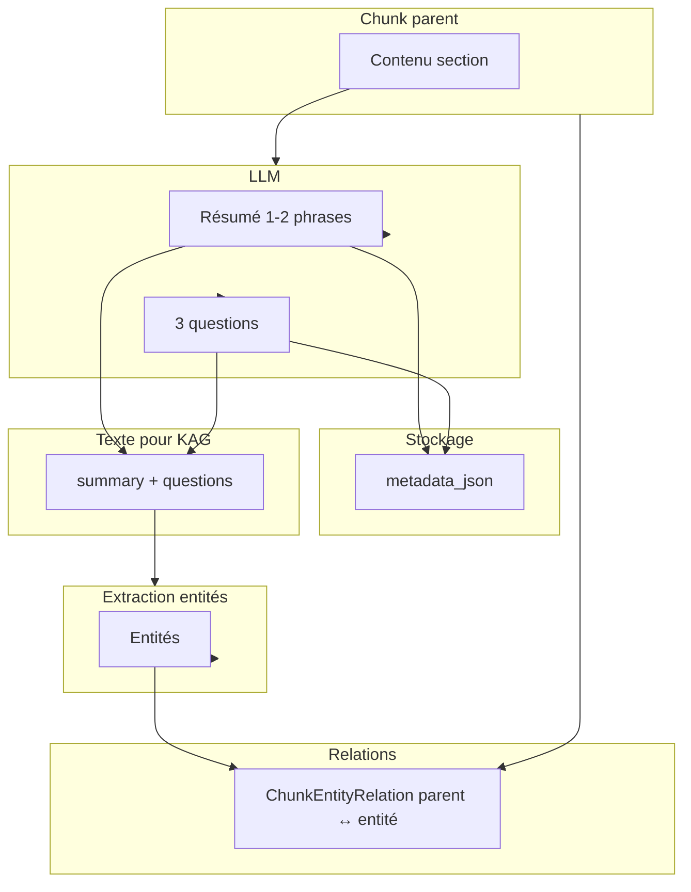
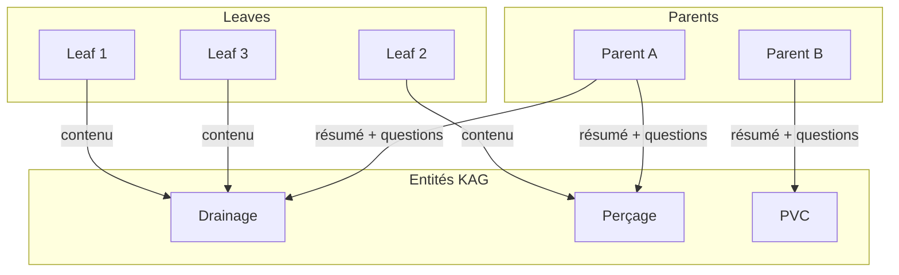

# Étape 2 : Embedding et KAG

_Dernière mise à jour : 2026-03-17_

Après le chunking, chaque note est traitée par un worker en arrière-plan qui : (1) génère les **embeddings** pour les chunks **leaves** uniquement ; (2) lance l’**extraction KAG** sur les leaves puis l’**enrichissement des parents** (résumé + questions, puis entités). Les vecteurs et le graphe KAG alimentent ensuite la recherche et la réponse.

---

## Vue d’ensemble du processus

L’embedding ne concerne que les **leaves** ; les **parents** ne sont pas vectorisés. En revanche, les parents sont enrichis avec un résumé et des questions, puis reliés au graphe KAG via les entités extraites de ce texte synthétique.

---

## Génération des embeddings (leaves uniquement)

- **Cible** : tous les chunks dont `is_leaf = true` et qui n’ont pas encore d’embedding.
- **Modèle** : modèle d’embedding configuré (ex. BGE-m3), dimension fixe (ex. 1024), utilisé via une API dédiée.
- **Déroulement** : les contenus des leaves sont envoyés par **batch** (taille configurable) pour limiter les appels et la charge. Les vecteurs retournés sont écrits en base en une opération groupée (table temporaire + mise à jour en masse) pour de meilleures performances.
- **Stockage** : la colonne `embedding` de la table des chunks est de type vecteur (pgvector). Seuls les leaves ont donc un vecteur non nul ; les parents restent sans embedding.

---

## Extraction KAG sur les leaves

Dès que les embeddings des leaves sont en base, le même worker lance l’extraction KAG pour la note.

- **Entrée** : contenu texte de chaque chunk **leaf** (longueur minimale pour éviter le bruit).
- **Traitement** : pour chaque leaf, un LLM (configurable) reçoit le texte et un prompt demandant une liste d’**entités techniques** avec leur type et un score d’importance. Les types d’entités sont fixes (équipement, procédure, paramètre, composant, référence, lieu).
- **Sortie** : liste d’entités (nom, type, importance). Les noms sont **normalisés** (minuscules, sans accents, caractères spéciaux supprimés) pour dédupliquer entre chunks et notes.
- **Graphe** :  
  - Chaque entité est créée ou récupérée dans la table des entités (par projet, clé normalisée).  
  - Une **relation** (chunk_id, entity_id, relevance_score, project_id) est créée pour chaque couple (leaf, entité). Ainsi, les **leaves** sont reliées aux nœuds du graphe.

Les anciennes relations KAG de la note sont supprimées avant cette étape pour repartir sur une indexation propre.

---

## Enrichissement des parents (résumé + questions)

Si l’option d’enrichissement parent est activée, le worker traite ensuite **chaque chunk parent** de la note.

- **Entrée** : contenu texte du parent (toute la section agrégée).
- **Appel LLM** : un prompt demande un **résumé en 1–2 phrases** (intention métier de la section) et **exactement 3 questions** auxquelles la section peut répondre, telles qu’un technicien ou un commercial les poserait.
- **Stockage** : le résultat est écrit dans `metadata_json` du chunk parent sous les clés `summary` et `generated_questions` (liste de trois chaînes). Aucune nouvelle table n’est créée.
- **Extraction KAG sur le parent** : le texte utilisé pour le graphe est la concaténation du résumé et des trois questions. Le même pipeline d’extraction d’entités (LLM → normalisation → entités) est appliqué à ce texte. Les **relations** créées lient cette fois le **chunk parent** (et non une leaf) aux entités. Ainsi, une section comme « Drainage » peut être reliée à l’entité « drainage » même si le mot n’apparaît pas dans chaque petit fragment.

---

## Schéma complet du processus KAG (leaves + parents)

Les leaves sont reliées aux entités via le **contenu** ; les parents sont reliés via le **résumé et les questions** stockés dans `metadata_json`. Lors de la recherche, le graphe peut donc retourner à la fois des leaves et des parents selon les entités matchées.

---

## Tables impliquées (conceptuel)

- **Chunks (notechunk)** : chaque chunk a un `id`, un `note_id`, un flag `is_leaf`, un `content`, et éventuellement un `embedding` (rempli seulement pour les leaves). Les parents enrichis ont dans `metadata_json` les champs `summary` et `generated_questions`.
- **Entités (knowledgeentity)** : identifiant, nom affiché, nom normalisé, type, projet, nombre de mentions. Une entité est unique par (projet, nom normalisé).
- **Relations (chunkentityrelation)** : lien entre un chunk (leaf ou parent) et une entité, avec un score de pertinence et le projet. Une même entité peut être liée à plusieurs chunks (leaves et/ou parents).

Aucune migration Alembic n’est nécessaire pour l’enrichissement parent : tout tient dans les champs existants (`metadata_json`) et les tables KAG déjà présentes.

---

## Ordre d’exécution dans le worker

1. Génération des embeddings pour les leaves de la note (batch + stockage).
2. Suppression des anciennes relations KAG pour la note.
3. Pour chaque leaf : extraction d’entités → création/mise à jour des entités → création des relations (chunk_id = leaf).
4. Si l’enrichissement parent est activé : pour chaque parent de la note, génération résumé + 3 questions → mise à jour `metadata_json` → extraction d’entités sur (résumé + questions) → création des relations (chunk_id = parent).
5. Marquer la note comme traitée (completed).

Tout se fait dans le même worker après le chunking ; il n’y a pas de file séparée pour le KAG. Le coût supplémentaire est principalement les appels LLM (un par leaf pour les entités, un par parent pour le résumé et les questions), une seule fois à l’indexation.
