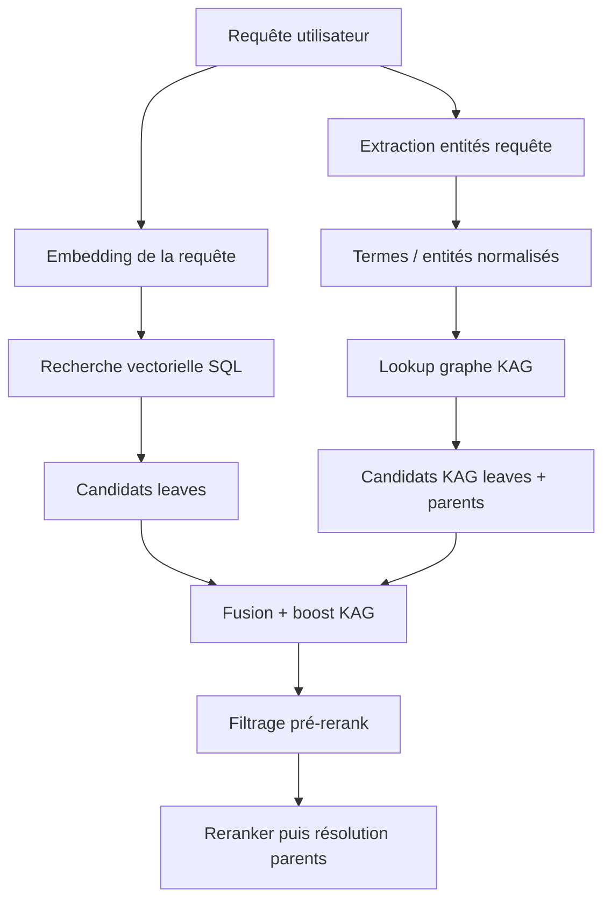
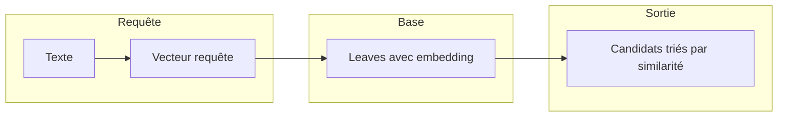
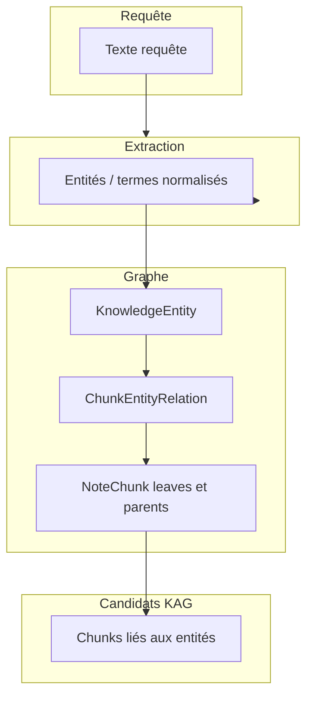
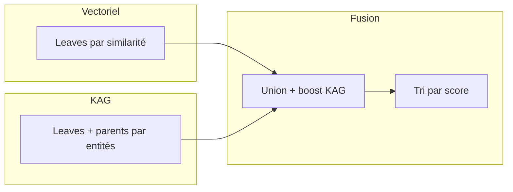

# Étape 3 : Retrieval (recherche vectorielle et KAG)

_Dernière mise à jour : 2026-03-17_

La phase de retrieval a pour but de trouver les **passages** les plus pertinents pour une question utilisateur. Elle combine une **recherche vectorielle** sur les chunks leaves et un **enrichissement via le graphe KAG** (entités et relations), qui peut renvoyer à la fois des leaves et des parents. Les candidats sont ensuite fusionnés puis passés au reranker (étape 4).

---

## Vue d’ensemble du retrieval

La recherche vectorielle s’appuie uniquement sur les **leaves** (seuls à avoir un embedding). Le graphe KAG, lui, peut retourner des **leaves** et des **parents** liés aux entités détectées dans la requête ou aux termes extraits.

---

## Recherche vectorielle (leaves)

- **Entrée** : vecteur de la requête (même modèle et même dimension que les embeddings des chunks).
- **Cible** : tous les chunks **leaves** du projet ayant un embedding non nul, filtrés par projet et utilisateur.
- **Méthrique** : similarité cosinus (ou équivalent selon l’opérateur pgvector utilisé). Les chunks sont triés par similarité décroissante.
- **Volume** : on récupère un multiple du nombre de passages souhaités (ex. k×3) pour laisser de la marge au filtrage et au reranking. Ce sont uniquement des **leaves**.

Aucun parent n’est retourné par cette branche : les parents n’ont pas d’embedding.

---

## Enrichissement KAG : entités et lookup graphe

En parallèle (ou juste après) la recherche vectorielle, le système enrichit les candidats via le **graphe de connaissances**.

### Extraction des entités de la requête

- **Entrée** : texte de la requête utilisateur.
- **Traitement** : une extraction d’entités peut être faite via un modèle LLM (même logique de normalisation que côté indexation). En parallèle, des **termes significatifs** sont aussi extraits lexicalement depuis la requête.
- **Sortie** : liste de noms normalisés (ex. « pompe », « drainage », « perçage »). Les termes servent au lookup graphe ; les entités LLM, quand disponibles, servent d’**entités pivot** pour renforcer certains candidats KAG.

### Lookup dans le graphe KAG

- **Entrée** : liste de termes (mots significatifs de la requête) et/ou entités extraites de la requête, normalisés ; périmètre projet et utilisateur.
- **Traitement** : recherche des **chunks** (leaves ou parents) liés à ces termes via la table des relations chunk–entité. Les entités sont identifiées par nom normalisé ; les relations donnent les `chunk_id` et un score de pertinence.
- **Sortie** : liste de candidats (chunks) avec un score de pertinence. Ces chunks peuvent être des **leaves** ou des **parents** : le filtre « uniquement leaves » a été retiré pour permettre de remonter des sections entières lorsqu’elles sont reliées aux bonnes entités (ex. section « Drainage » liée à l’entité « drainage » via son résumé et ses questions).

Les **relations** sont donc : requête → entités → relations chunk–entité → chunks (leaves ou parents). C’est ce qui permet de « lier les nœuds » (sections et fragments) via les concepts partagés.

---

## Fusion des candidats vectoriels et KAG

- **Entrée** : liste des candidats vectoriels (leaves, triés par similarité) et liste des candidats KAG (leaves et éventuellement parents, avec score de pertinence).
- **Règles** :  
  - Les candidats déjà présents dans la liste vectorielle conservent leur score.  
  - Les candidats **uniquement** trouvés via le graphe sont **ajoutés** à la liste et reçoivent un **boost** fixe (ex. +0,15) pour ne pas être noyés par les scores vectoriels.  
  - Si des « entités pivot » (issues de la requête) sont disponibles, les candidats KAG dont l’entité matchée fait partie de ces pivots peuvent recevoir un boost plus fort.
- **Sortie** : une liste unique de candidats (leaves + éventuels parents), triée par score décroissant, sans doublon (déduplication par identifiant de nœud).

Cette liste fusionnée est ensuite filtrée (seuils de similarité) puis envoyée au reranker (voir [04-reranker-et-reponse.md](04-reranker-et-reponse.md)).

---

## Rôle des leaves et des parents dans le retrieval

- **Leaves** :  
  - Représentent la quasi-totalité des candidats **vectoriels** (similarité sémantique directe).  
  - Peuvent aussi arriver via le **graphe** (relation leaf–entité).  
  - Après rerank, chaque leaf retenue pourra être « remontée » à son parent (résolution parents) pour former le passage final.

- **Parents** :  
  - N’apparaissent **pas** dans la recherche vectorielle (pas d’embedding).  
  - Peuvent apparaître **uniquement** via le graphe KAG, grâce aux relations parent–entité créées à partir du résumé et des questions.  
  - Quand un parent est retourné comme candidat, il est gardé tel quel : son contenu (section entière) sera utilisé comme passage. Pas de « remontée » supplémentaire puisqu’il est déjà au niveau section.

Ainsi, le retrieval exploite à la fois la similarité textuelle (leaves) et les **relations** du graphe (leaves et parents), ce qui permet de retrouver des sections par intention métier (ex. « Comment évacuer l’eau du dormant ? ») même si la formulation exacte n’est pas dans les fragments.

---

## Isolation et sécurité

- Toutes les requêtes (vectorielles et graphe) sont filtrées par **project_id** et **user_id** : un utilisateur ne voit que les chunks et entités de ses projets.
- Le graphe KAG est **isolé par projet** : les entités et relations sont créées et interrogées dans le périmètre d’un seul projet, sans fuite entre projets.
