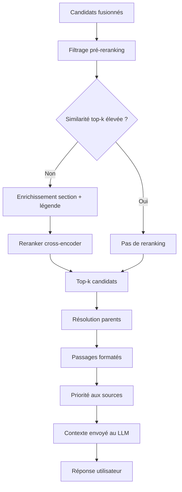
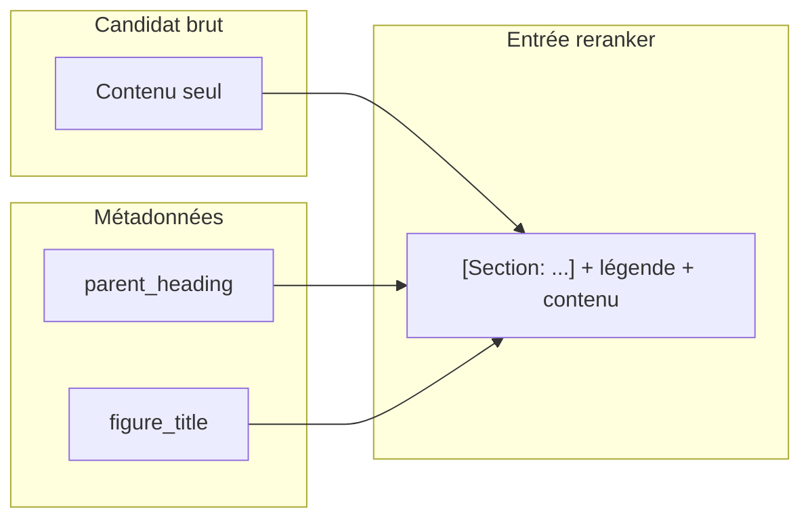
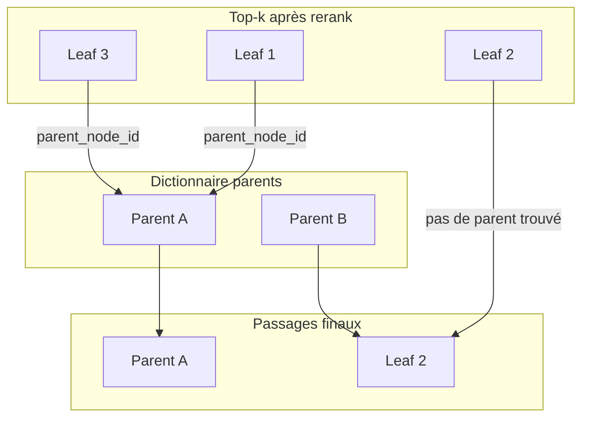
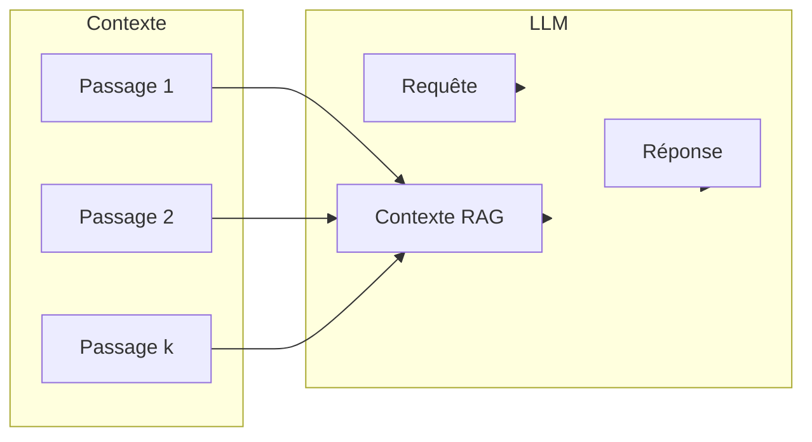

# Étape 4 : Reranker et construction de la réponse

_Dernière mise à jour : 2026-03-17_

Après la fusion des candidats vectoriels et KAG, le flux applique un **filtrage**, un **reranking** optionnel, une **résolution des parents** pour enrichir le contexte, puis une **priorisation des sources**. Les passages obtenus sont formatés et envoyés au LLM comme contexte RAG pour produire la réponse finale.

---

## Enchaînement après la fusion

---

## Filtrage pré-reranking

- **Objectif** : éviter d’envoyer au reranker des candidats dont la similarité vectorielle (ou le score fusionné) est trop faible.
- **Règle** : les candidats dont le score est en dessous d’un seuil configurable sont écartés. Seuls les candidats au-dessus de ce seuil sont conservés pour la suite.
- **Effet** : réduction du nombre de candidats à traiter (gain de temps et de coût) tout en gardant les passages potentiellement pertinents.

---

## Early stopping (reranking optionnel)

- **Objectif** : quand les meilleurs candidats ont déjà des scores très élevés, le reranking n’apporte que peu de gain ; on peut le sauter pour accélérer.
- **Règle** : si le nombre de candidats filtrés est au moins égal à k (nombre de passages souhaités) et que la **moyenne des scores des k premiers** dépasse un seuil configurable, on considère que l’ordre est déjà bon et on **ne lance pas** le reranker. Les k premiers candidats sont pris tels quels.
- **Effet** : dans une part non négligeable des requêtes, la latence diminue sans dégrader la qualité perçue.

---

## Enrichissement du texte avant reranking

Avant d’appeler le reranker, le **texte** de chaque candidat est enrichi avec des métadonnées déjà présentes sur le chunk :

- **Section** : le titre de section (parent_heading ou heading) est préfixé au contenu, par exemple sous la forme « [Section: 1.3.1 Montage] ».
- **Légende** : si le chunk ou sa section a une légende (figure_title ou image_anchor), elle est ajoutée au début du bloc.

Le reranker reçoit donc une requête + des textes « section + légende + contenu ». Les chunks dont la section ou la légende sont très descriptifs sont ainsi mieux valorisés. Le même enrichissement est réutilisé plus tard pour le passage final envoyé au LLM.

---

## Reranker (cross-encoder)

- **Rôle** : réordonner les candidats en fonction de leur pertinence par rapport à la **requête** utilisateur, au lieu de s’en tenir au score vectoriel ou KAG.
- **Modèle** : un modèle de type cross-encoder (ex. BGE-reranker-v2-m3) est utilisé : il prend en entrée la paire (requête, passage) et produit un score de pertinence. Ce score est plus fin que la similarité cosinus car il tient compte de l’interaction requête–passage.
- **Cible** : on ne reranke qu’un sous-ensemble des candidats filtrés (par exemple les N premiers, N configurable) pour limiter le temps de calcul. Les candidats sont des **leaves** (ou des nœuds déjà résolus) ; le texte passé au reranker est celui enrichi (section + légende + contenu).
- **Sortie** : liste des candidats rerankée par score cross-encoder décroissant ; on conserve les k premiers.

Si le reranker est indisponible ou désactivé, on conserve l’ordre issu de la fusion (scores vectoriels + boost KAG).

---

## Résolution des parents

- **Objectif** : pour chaque leaf retenue après rerank, remplacer le **contenu du fragment** par le **contenu du parent** (toute la section) lorsqu’un parent existe. Ainsi, le LLM reçoit des blocs de contexte plus cohérents (une section entière plutôt qu’une ligne de tableau isolée).
- **Déroulement** :  
  1. Une seule fois par requête, on charge **tous** les chunks parents du projet (filtrés par projet et utilisateur) et on construit un dictionnaire « node_id du parent → nœud parent » (contenu + métadonnées).  
  2. Pour chaque candidat du top-k après rerank : si le candidat est une **leaf**, on regarde son `parent_node_id` ; si ce parent existe dans le dictionnaire, on **remplace** le nœud candidat par le nœud **parent**. Si le candidat est déjà un **parent** (retourné par le graphe KAG), il n’a pas de parent_node_id (ou null) : on le garde tel quel.  
  3. On déduplique par `node_id` : si plusieurs leaves du top-k appartiennent à la même section, on ne garde qu’un seul passage (celui du parent), évitant de répéter la même section.
- **Résultat** : la liste finale de « nœuds » peut contenir des leaves (quand aucun parent n’a été trouvé) et des parents (sections entières). C’est cette liste qui est convertie en passages texte.

---

## Construction des passages (format pour le LLM)

Pour chaque nœud final (leaf ou parent), on construit un **passage** structuré :

- **Titre de la note** : en en-tête (ex. en gras) pour que le LLM sache de quel document provient le passage.
- **Section et légende** : comme pour le reranker, le contenu est préfixé par la section et la légende si disponibles (parent_heading, figure_title).
- **Contenu** : le texte du chunk (ou du parent substitué).

Le passage contient aussi des métadonnées (note_id, chunk_id, score, page_no, section, etc.) utilisées côté applicatif (affichage des sources, liens). Les chunks purement image sont exclus du contexte final envoyé au LLM pour éviter le bruit textuel.

---

## Priorité aux sources (source authority)

- **Problème** : avec le KAG, beaucoup de passages peuvent provenir de documents très génériques (catalogue, guide général). L’utilisateur peut pourtant avoir une question ciblée sur un document précis (ex. dépliant LUMÉAL).
- **Règle** : on applique un **boost** aux passages dont le **titre de la note** partage des mots significatifs avec la **requête**. Les passages dont la source « correspond » à la requête remontent dans l’ordre final.
- **Effet** : le contexte envoyé au LLM commence par les sources les plus alignées avec l’intention (ex. document nommé dans la question), ce qui améliore la pertinence de la réponse sans changer le contenu des passages.

---

## Contexte RAG et réponse

- Les **passages** ainsi ordonnés et formatés sont concaténés (ou insérés dans un gabarit) pour former le **contexte RAG** attaché à la requête utilisateur.
- Le **LLM** reçoit : les messages précédents de la conversation (si chat), la requête, et ce contexte (souvent présenté comme « extraits de vos notes » ou « sources »). Il génère une réponse en s’appuyant sur ces extraits.
- La **réponse** est renvoyée à l’utilisateur ; les métadonnées des passages permettent d’afficher les sources (notes, sections, pages) et de proposer des liens vers l’édition des notes.

---

## Fallback lexical

Si la recherche vectorielle (et donc la fusion) ne retourne **aucun** candidat (par exemple pas d’embeddings dans le projet), le système bascule sur un **fallback lexical** : recherche par mots-clés (termes significatifs de la requête) dans le contenu des chunks. Les passages ainsi trouvés sont formatés de la même façon (sans reranker ni résolution parents si non applicables) et servent de contexte minimal pour que le LLM puisse tout de même répondre.

---

## Résumé des étapes (sans code)

| Étape | Rôle |
|--------|------|
| Filtrage pré-rerank | Supprimer les candidats sous le seuil de similarité. |
| Early stopping | Ne pas lancer le reranker si les top-k sont déjà très bien notés. |
| Enrichissement section + légende | Préfixer le contenu pour le reranker et le passage final. |
| Reranker | Réordonner les candidats par pertinence requête–passage (cross-encoder). |
| Résolution parents | Remplacer une leaf par son parent (section entière) quand c’est possible. |
| Format passage | Titre de note + section + légende + contenu. |
| Source authority | Favoriser les passages dont la source correspond à la requête. |
| Contexte → LLM | Envoyer les passages comme contexte RAG et générer la réponse. |
